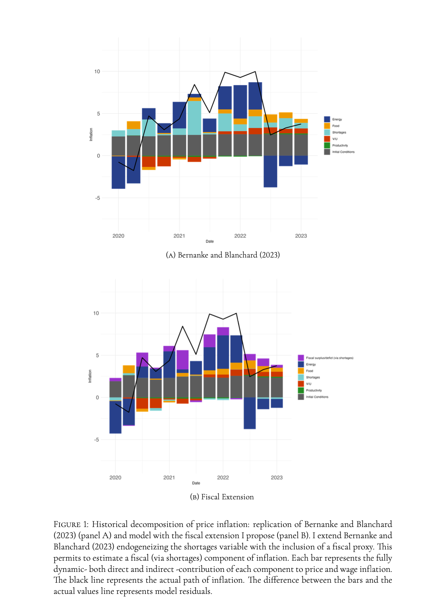

# _What Caused U.S. Postpandemic Inflation? A Fiscal Extension of Bernanke and Blanchard (2023)_
### [Luigi Lorenzoni](mailto:luigi.lorenzoni@studbocconi.it?subject=[GitHub]%Bernanke%20Blanchard%20)
This repository provides codes related to [Bernanke and Blanchard (2023)](https://www.brookings.edu/wp-content/uploads/2023/04/bernanke-blanchard-conference-draft_5.23.23.pdf). Firstly, I provide a replication package in R for all the results of the paper. Secondly, I provide the code for a fiscal extension of their empirical model,which constitutes the core of my [undergraduate thesis](https://www.dropbox.com/scl/fi/b37gdpdzzeugwhygr2tqg/tesi_lorenzoni_def.pdf?rlkey=h1hlmgj1177jjxcz2m4cpgpr6&st=rxwyc3uq&dl=0).

## Data
* [data_us.csv](empirics/data/data_us.csv) is the dataset I import into my code. It is drawn from the replication package provided by Bernanke and Blanchard with the addition of the fiscal variable
* [auxil](auxil) provides some useful auxiliary files for the output

## Code
* [master.R](empirics/code/master.R) is the master script which sources all the following scripts
* [bl_be_us.R](empirics/code/bl_be_us.R) provides the standard replication of the paper
* [bl_be_us_boot.R](empirics/code/bl_be_us_boot.R) provides the replication of model implied price inflation responses with confidence intervals
* [bl_be_us_fiscal.R](empirics/code/bl_be_us_fiscal.R) proposes a "fiscal extension" of the model
* [bl_be_us_fiscal_boot.R](empirics/code/bl_be_us_fiscal_boot.R) derives the extended model implied responses of price inflation with confidence intervals

## Results

This work makes two main contributions. Firstly, I propose an extension of the empirical model introduced by Bernanke and Blanchard (2023) to account for fiscal policy. Determining endogenously the state of supply chains I show that its pure contribution to inflation is small and that it was mediating a demand component attributable to accommodating fiscal policy. Through an historical decomposition I estimate this fiscal component to sum to 2.28 percentage points of price inflation over the period 2020Q1:2023Q1. I interpret this result within a standard AS-AD framework with supply constraints. Secondly, I provide a R replication package for all the results of Bernanke and Blanchard (2023). I integrated the possibility to derive confidence intervals for the responses of price inflation implied by the standard model through bootstrapping. I show these are generally not statistically different from zero.

